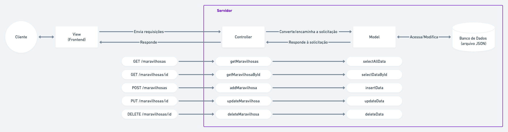
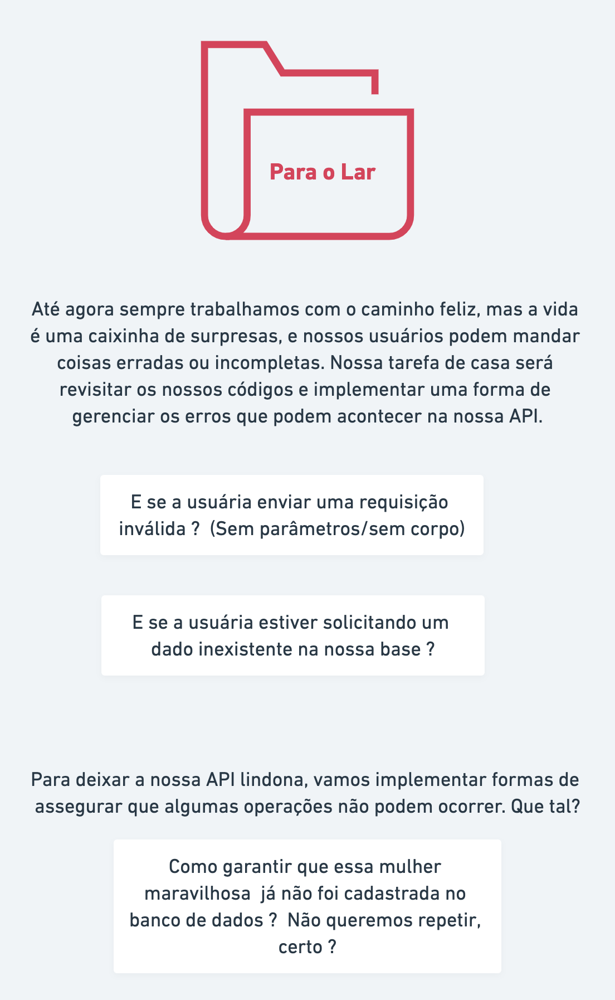

# Semana 11 - Projeto 2

Yey! Bem vinda a mais uma semana, vamos fazer um projeto bem próximo de um dia comum na vida de uma desenvolvedora.

### Agenda:

- Apresentação professora & monitoras;
- Panorama do projeto;
- Leitura das tarefas;
- Recreio (?)
- Formação das duplas e trabalho em conjunto;
- **Pausa para o almoço**
- 30 minutos para tirar dúvidas gerais do andamento do projeto
- Nova formação de duplas
- Desafio para o lar e preparação para Quarta-Feira

### Arquitetura desejada


*Representação visual/diagrama das camadas do nosso Backend*

### Fluxo do consumo da API



### Estrutura do projeto


```
 📁 api
   |
   |-  📁 src
   |    |  
   |    |- 📁 routes
   |    |- 📁 controller
   |    |- 📁 model
   |    |- 📁 data
   |    |- 📄 app.js
   |
   |- 📄 package.json 
   |- 📄 server.js
```


### Desafios do dia:


### 🏡 Para o lar



### Para Quarta-feira


> Para subir o front na sua máquina basta navegar até a pasta /ui no seu terminal e rodar `npm install` e em seguida, `npm start`, depois você pode ver o projeto no seu navegador acessando: http://localhost:3000.

## Nota importante sobre a nossa arquitetura
Essa arquitetura que propusemos no exercício é apenas para efeitos didáticos, não significa que em um projeto do "mundo real" as coisas funcionem exatamente dessa forma.  Só a título de curiosidade, no mundo real a camada model guarda os modelos das entidades, esse papel que atribuímos a ela no nosso exercício, geralmente é desempenhado por uma camada chamada Repository. Nesse exercícios nós propusemos essa arquitetura diferente para que pudéssemos exercitar a transferência de responsabilidades entre camadas, para vocês começarem a se habituar com esse fluxo, ok ?
